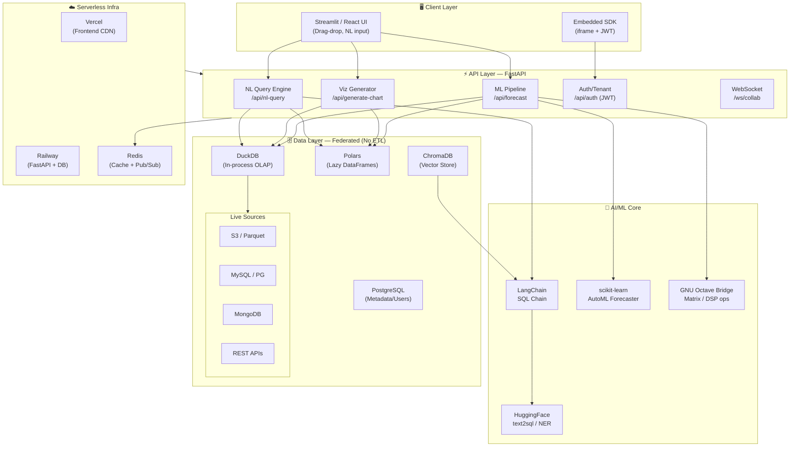

#OLI — FEDERATED DATA INTELLIGENCE & AI-POWERED ANALYTICS PLATFORM

[](https://opensource.org/licenses/MIT)
[](https://fastapi.tiangolo.com)
[](https://python.org)
[](https://duckdb.org)
[](https://railway.app)

---

## 🗺️ Architecture Overview



---

## 🆓 Free Stack

| Layer | Tool | Why |
|---|---|---|
| **Backend** | FastAPI 0.110 | Async, auto-docs, 3× faster than Flask |
| **Query Engine** | DuckDB + Polars | Zero-copy OLAP, reads S3/Parquet natively |
| **AI / NL** | LangChain OSS + `defog/sqlcoder-7b` | Free HuggingFace text2sql, no OpenAI key needed |
| **Vector Store** | ChromaDB (local) | Stores schema embeddings for NL matching |
| **ML** | scikit-learn + statsmodels | Full AutoML + ARIMA, zero cost |
| **Math Bridge** | GNU Octave + `oct2py` | Free MATLAB-compatible DSP/matrix ops |
| **Frontend** | Streamlit 1.33 | Rapid dashboards, Python-native |
| **Viz** | Plotly + Mermaid.js | Interactive charts + architecture diagrams |
| **Auth** | python-jose + passlib | JWT multi-tenant, no vendor lock-in |
| **Deploy** | Vercel (frontend) + Railway (API) | Both have generous free tiers |
| **Cache** | Redis (Railway add-on) | Sub-5ms query cache, pub/sub for collab |

---

## 🏗️ Project Structure

```
oli/
├── backend/
│   ├── main.py                  # FastAPI app entrypoint
│   ├── routers/
│   │   ├── nl_query.py          # NL → SQL + AI insight endpoint
│   │   ├── forecast.py          # Time series / Octave endpoint
│   │   ├── charts.py            # Auto-viz generator
│   │   └── auth.py              # JWT multi-tenant auth
│   ├── core/
│   │   ├── duck_engine.py       # Federated DuckDB query runner
│   │   ├── nl_parser.py         # LangChain SQL chain
│   │   ├── automl.py            # scikit-learn AutoML
│   │   ├── octave_bridge.py     # oct2py GNU Octave wrapper
│   │   └── vector_store.py      # ChromaDB schema embeddings
│   └── models/
│       ├── schemas.py           # Pydantic request/response models
│       └── tenant.py            # Multi-tenant data models
├── frontend/
│   ├── app.py                   # Streamlit main dashboard
│   ├── pages/
│   │   ├── 01_query.py          # NL query interface
│   │   ├── 02_charts.py         # Drag-drop chart builder
│   │   └── 03_forecast.py       # Time series + predictions
│   └── components/
│       └── chart_renderer.py    # Plotly chart factory
├── ml/
│   ├── forecaster.py            # Python ARIMA + Octave FFT wrapper
│   ├── time_series.m            # GNU Octave forecasting script
│   └── auto_prep.py             # Data wrangling pipeline
├── embed/
│   └── sdk.js                   # Embedded dashboard JS SDK
├── docker-compose.yml
├── railway.toml
├── vercel.json
└── requirements.txt
```

---

## 🚀 Code Skeleton 1 — FastAPI: NL Query → SQL + AI Insight

```python
# backend/routers/nl_query.py
from fastapi import APIRouter, HTTPException
from pydantic import BaseModel
from langchain_community.utilities import SQLDatabase
from langchain_community.agent_toolkits import create_sql_agent
from langchain_huggingface import HuggingFacePipeline
from transformers import pipeline as hf_pipeline
import duckdb, chromadb

router = APIRouter(prefix="/api", tags=["nl-query"])

chroma_client = chromadb.Client()
schema_collection = chroma_client.get_or_create_collection("schemas")

def get_llm():
    pipe = hf_pipeline(
        "text-generation",
        model="defog/sqlcoder-7b-2",
        max_new_tokens=256,
        device_map="auto",
    )
    return HuggingFacePipeline(pipeline=pipe)

class NLQueryRequest(BaseModel):
    question: str
    data_source: str
    tenant_id: str

class NLQueryResponse(BaseModel):
    sql: str
    results: list[dict]
    insight: str
    chart_type: str
    row_count: int

@router.post("/nl-query", response_model=NLQueryResponse)
async def nl_query(req: NLQueryRequest):
    try:
        con = duckdb.connect()
        con.execute("INSTALL httpfs; LOAD httpfs;")

        if req.data_source.endswith(".parquet"):
            con.execute(f"CREATE VIEW source AS SELECT * FROM read_parquet('{req.data_source}')")
        elif req.data_source.endswith(".csv"):
            con.execute(f"CREATE VIEW source AS SELECT * FROM read_csv_auto('{req.data_source}')")
        else:
            con.execute(f"ATTACH '{req.data_source}' AS remote_db (TYPE POSTGRES)")

        db = SQLDatabase.from_uri("duckdb:///:memory:")
        agent = create_sql_agent(llm=get_llm(), db=db, verbose=False)

        schema_hits = schema_collection.query(query_texts=[req.question], n_results=3)
        context_hint = "\n".join(schema_hits["documents"][0]) if schema_hits["documents"] else ""

        sql_result = agent.invoke({"input": f"{req.question}\n\nSchema hints:\n{context_hint}"})
        generated_sql = sql_result.get("output", "")

        df = con.execute(generated_sql).df()
        results = df.head(500).to_dict(orient="records")

        insight_pipe = hf_pipeline("text-generation",
                                    model="mistralai/Mistral-7B-Instruct-v0.2",
                                    max_new_tokens=100)
        insight = insight_pipe(
            f"Query: {req.question}\nData: {df.describe().to_string()}\nSummarize in 2 sentences:"
        )[0]["generated_text"].strip()

        return NLQueryResponse(
            sql=generated_sql, results=results, insight=insight,
            chart_type=_suggest_chart(df), row_count=len(df),
        )
    except Exception as e:
        raise HTTPException(status_code=500, detail=str(e))

def _suggest_chart(df) -> str:
    numeric = df.select_dtypes(include="number").columns.tolist()
    date_cols = [c for c in df.columns if "date" in c.lower() or "time" in c.lower()]
    cat = df.select_dtypes(include="object").columns.tolist()
    if date_cols and numeric:      return "line"
    if len(numeric) >= 2:          return "scatter"
    if cat and numeric:            return "bar"
    return "table"
```

---

## 🖥️ Code Skeleton 2 — Streamlit Dashboard: Drag-Drop + Auto-Charts

```python
# frontend/app.py
import streamlit as st
import plotly.express as px
import pandas as pd
import requests

st.set_page_config(page_title="OLI", page_icon="⚡", layout="wide")
API_BASE = "http://localhost:8000/api"

with st.sidebar:
    st.markdown("# ⚡ OLI")
    st.caption("ஒளி · Light · Intelligence")
    st.markdown("---")
    uploaded = st.file_uploader("Upload file", type=["parquet", "csv"])
    data_source = f"/tmp/{uploaded.name}" if uploaded else "data/sample_sales.parquet"
    if uploaded:
        with open(data_source, "wb") as f:
            f.write(uploaded.read())
    plan = st.radio("Plan", ["🆓 Free (≤10 users)", "💎 Pro — $29/mo"])

st.title("⚡ OLI — Federated Data Intelligence")
st.caption("ஒளி · Ask your data anything, in plain English.")

col1, col2 = st.columns([3, 1])
with col1:
    question = st.text_input("", placeholder='"Show monthly revenue by region for Q4"',
                              label_visibility="collapsed")
with col2:
    run_query = st.button("🔍 Ask AI", use_container_width=True, type="primary")

if run_query and question:
    with st.spinner("🧠 OLI is thinking..."):
        try:
            res = requests.post(f"{API_BASE}/nl-query",
                                json={"question": question, "data_source": data_source,
                                      "tenant_id": "demo"}, timeout=60)
            data = res.json()
        except Exception as e:
            st.error(f"API error: {e}")
            data = None

    if data:
        df = pd.DataFrame(data["results"])
        st.info(f"💡 **OLI Insight:** {data['insight']}")
        m1, m2, m3 = st.columns(3)
        m1.metric("Rows", f"{data['row_count']:,}")
        m2.metric("Chart", data["chart_type"].upper())
        m3.metric("Columns", len(df.columns))
        chart_col, sql_col = st.columns([2, 1])
        with chart_col:
            numeric = df.select_dtypes(include="number").columns.tolist()
            cat = df.select_dtypes(include="object").columns.tolist()
            date_cols = [c for c in df.columns if "date" in c.lower()]
            fig = None
            if data["chart_type"] == "line" and date_cols:
                fig = px.line(df, x=date_cols[0], y=numeric[0], template="plotly_dark", markers=True)
            elif data["chart_type"] == "bar" and cat:
                fig = px.bar(df, x=cat[0], y=numeric[0], color=cat[0], template="plotly_dark")
            elif data["chart_type"] == "scatter" and len(numeric) >= 2:
                fig = px.scatter(df, x=numeric[0], y=numeric[1], template="plotly_dark")
            if fig:
                st.plotly_chart(fig, use_container_width=True)
        with sql_col:
            st.code(data["sql"], language="sql")
            st.dataframe(df.head(50), use_container_width=True)
```

---

## 📈 Code Skeleton 3 — Octave/Python Time Series Forecaster

```python
# ml/forecaster.py
import numpy as np
import pandas as pd
from statsmodels.tsa.statespace.sarimax import SARIMAX
from sklearn.preprocessing import StandardScaler
from sklearn.metrics import mean_absolute_percentage_error
import warnings
warnings.filterwarnings("ignore")

try:
    from oct2py import octave
    OCTAVE_AVAILABLE = True
except ImportError:
    OCTAVE_AVAILABLE = False

class OliForecaster:
    def __init__(self, horizon: int = 30):
        self.horizon = horizon
        self.scaler = StandardScaler()

    def detect_seasonality(self, series: np.ndarray) -> int:
        if OCTAVE_AVAILABLE:
            octave.push("ts_data", series.tolist())
            octave.eval("""
                N = length(ts_data);
                Y = fft(ts_data - mean(ts_data));
                P = abs(Y(1:floor(N/2))).^2;
                freqs = (1:floor(N/2)) / N;
                P(1) = 0;
                [~, idx] = max(P);
                dominant_period = round(1 / freqs(idx));
            """)
            return max(2, min(int(octave.pull("dominant_period")), 365))
        for p in [7, 12, 30, 52]:
            if len(series) >= 2 * p:
                return p
        return 7

    def predict(self, df: pd.DataFrame, date_col: str, value_col: str) -> dict:
        df = df.sort_values(date_col).copy()
        df[date_col] = pd.to_datetime(df[date_col])
        series = df.set_index(date_col)[value_col].dropna().astype(float)
        scaled = self.scaler.fit_transform(series.values.reshape(-1, 1)).flatten()
        period = self.detect_seasonality(scaled)

        best_aic, best_order = np.inf, (1, 1, 1)
        for p in range(3):
            for q in range(3):
                try:
                    res = SARIMAX(scaled, order=(p, 1, q),
                                  seasonal_order=(1, 1, 0, period),
                                  enforce_stationarity=False).fit(disp=False)
                    if res.aic < best_aic:
                        best_aic, best_order = res.aic, (p, 1, q)
                except Exception:
                    continue

        model = SARIMAX(scaled, order=best_order,
                        seasonal_order=(1, 1, 0, period),
                        enforce_stationarity=False).fit(disp=False)

        forecast_vals = self.scaler.inverse_transform(
            model.forecast(steps=self.horizon).reshape(-1, 1)).flatten()
        future_dates = pd.date_range(
            start=df[date_col].max(),
            periods=self.horizon + 1,
            freq=pd.infer_freq(df[date_col].sort_values()) or "D"
        )[1:]
        ci = model.get_forecast(steps=self.horizon).conf_int()

        return {
            "meta": {"sarima_order": best_order, "seasonal_period": period,
                     "aic": round(best_aic, 2), "octave_fft_used": OCTAVE_AVAILABLE},
            "historical": {"dates": df[date_col].astype(str).tolist(),
                           "values": df[value_col].tolist()},
            "forecast": {
                "dates": future_dates.astype(str).tolist(),
                "values": forecast_vals.tolist(),
                "ci_lower": self.scaler.inverse_transform(
                    ci.iloc[:, 0].values.reshape(-1, 1)).flatten().tolist(),
                "ci_upper": self.scaler.inverse_transform(
                    ci.iloc[:, 1].values.reshape(-1, 1)).flatten().tolist(),
            },
        }
```

---

## 💰 Monetization

```
Free  ──────────────────────────────────────────────────
  • ≤ 10 users · 5 dashboards · 3 data sources
  • 100 NL queries/month · OLI branding on embeds
  • $0/mo (Vercel + Railway free tiers)

Pro — $29/mo flat  ─────────────────────────────────────
  • Unlimited users, dashboards, sources, queries
  • Real-time WebSocket co-authoring
  • White-label embeds + custom domain
  • 30-day version history
  • Infra ~$7/mo → ~$22 margin per workspace

Enterprise — Custom  ────────────────────────────────────
  • Self-hosted Docker / Helm · SSO · SOC 2
  • Dedicated ML compute · SLA · From $499/mo
```

---

## 🗓️ Week 1–4 Roadmap

```
Week 1 — Foundation (5h)     Local prototype running
  [ ] Install deps + GNU Octave
  [ ] DuckDB against sample dataset
  [ ] FastAPI /health + NL query endpoint

Week 2 — AI & ML Core (6h)   Forecasting demo live
  [ ] Octave FFT + SARIMA grid search
  [ ] ChromaDB schema embeddings
  [ ] Auto-prep: nulls, type inference, dedup

Week 3 — Collab + Embed (5h) Sharable demo URL
  [ ] WebSocket real-time co-authoring
  [ ] JWT multi-tenant auth
  [ ] sdk.js embed · Railway + Vercel deploy

Week 4 — Launch (4h)         Public beta
  [ ] Stripe Pro tier ($29/mo)
  [ ] Landing page · demo GIF
  [ ] HN "Show HN" · Product Hunt

Total: ~20h  |  Cost: $0  |  Revenue day 1: Stripe live
```

---

## ⚙️ Quick Start

```bash
git clone https://github.com/your-org/oli.git && cd oli
pip install -r requirements.txt
sudo apt install octave            # Ubuntu · brew install octave on macOS
uvicorn backend.main:app --reload --port 8000
streamlit run frontend/app.py
# → http://localhost:8501
```

```
# requirements.txt
fastapi==0.110.0          uvicorn[standard]==0.29.0
duckdb==0.10.2            polars==0.20.18
langchain==0.1.16         langchain-community==0.0.36
langchain-huggingface==0.0.3  transformers==4.40.1
chromadb==0.4.24          statsmodels==0.14.2
scikit-learn==1.4.2       oct2py==5.6.0
streamlit==1.33.0         plotly==5.21.0
pandas==2.2.2             python-jose[cryptography]==3.3.0
passlib[bcrypt]==1.7.4    redis==5.0.4
pydantic==2.7.1
```

---

## 📄 License

MIT — free to use, modify, self-host.
White-label embedding requires a Pro or Enterprise license.

---

<p align="center">
  <b>⚡ OLI · ஒளி · Light</b><br/>
  Built for those tired of DAX hell and Tableau sprawl.<br/>
  <a href="https://oli.io">oli.io</a> · <a href="https://docs.oli.io">Docs</a> · <a href="https://discord.gg/oli">Discord</a>
</p>
